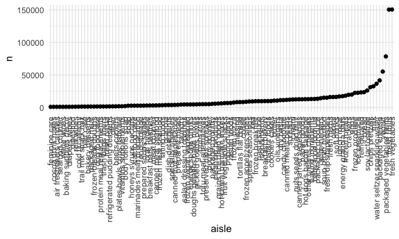
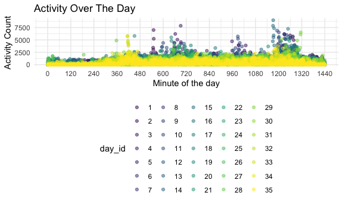
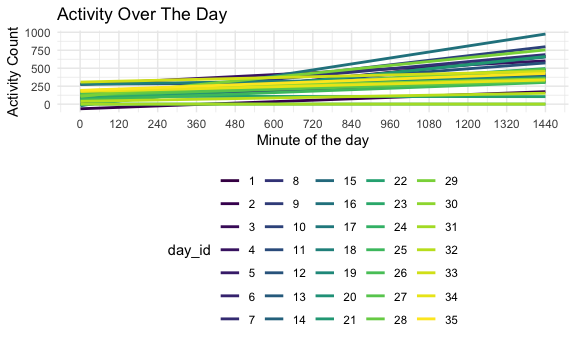

Homework 3
================
Xiangyi Liu (xl3048)
10/6/2020

## Problem 1

``` r
data("instacart")
```

This dataset contains 1384617 rows and … columns.

Observations are the level of items in orders by user. There are user /
order variables – user ID, order ID, order day, and order hour. There
are also item variables – name, aisle, department, and some numeric
codes.

How many aisles, and which are most items from?

``` r
instacart %>%
  count(aisle) %>%
  arrange(desc(n))
```

    ## # A tibble: 134 x 2
    ##    aisle                              n
    ##    <chr>                          <int>
    ##  1 fresh vegetables              150609
    ##  2 fresh fruits                  150473
    ##  3 packaged vegetables fruits     78493
    ##  4 yogurt                         55240
    ##  5 packaged cheese                41699
    ##  6 water seltzer sparkling water  36617
    ##  7 milk                           32644
    ##  8 chips pretzels                 31269
    ##  9 soy lactosefree                26240
    ## 10 bread                          23635
    ## # … with 124 more rows

Make plot.

``` r
instacart %>%
  count(aisle) %>%
  filter(n > 1000) %>%
  mutate(
    aisle = factor(aisle),
    aisle = fct_reorder(aisle,n) #reorder factor 'aisle' based on 'n'
  ) %>%
  ggplot(aes(x = aisle, y = n)) +
  geom_point() +
  theme(axis.text.x = element_text(angle = 90, vjust = 0.5, hjust = 1) )
```



Make a table.

``` r
instacart %>%
  filter(aisle %in% c("baking ingredients", "dog food care","packaged vegetables fruits")) %>%
  group_by(aisle) %>%
  count(product_name) %>%
  mutate(rank = min_rank(desc(n))) %>%
  filter(rank < 4) %>%
  arrange(aisle, rank) %>%
  knitr::kable()
```

| aisle                      | product\_name                                 |    n | rank |
| :------------------------- | :-------------------------------------------- | ---: | ---: |
| baking ingredients         | Light Brown Sugar                             |  499 |    1 |
| baking ingredients         | Pure Baking Soda                              |  387 |    2 |
| baking ingredients         | Cane Sugar                                    |  336 |    3 |
| dog food care              | Snack Sticks Chicken & Rice Recipe Dog Treats |   30 |    1 |
| dog food care              | Organix Chicken & Brown Rice Recipe           |   28 |    2 |
| dog food care              | Small Dog Biscuits                            |   26 |    3 |
| packaged vegetables fruits | Organic Baby Spinach                          | 9784 |    1 |
| packaged vegetables fruits | Organic Raspberries                           | 5546 |    2 |
| packaged vegetables fruits | Organic Blueberries                           | 4966 |    3 |

Apple vs. ice cream.

``` r
instacart %>%
  filter(product_name %in% c("Pink Lady Apple", "Coffee Ice Cream")) %>%
  group_by(product_name, order_dow) %>%
  summarize(mean_hour = mean(order_hour_of_day)) %>%
  pivot_wider(
    names_from = order_dow,
    values_from = mean_hour
  )
```

    ## `summarise()` regrouping output by 'product_name' (override with `.groups` argument)

    ## # A tibble: 2 x 8
    ## # Groups:   product_name [2]
    ##   product_name       `0`   `1`   `2`   `3`   `4`   `5`   `6`
    ##   <chr>            <dbl> <dbl> <dbl> <dbl> <dbl> <dbl> <dbl>
    ## 1 Coffee Ice Cream  13.8  14.3  15.4  15.3  15.2  12.3  13.8
    ## 2 Pink Lady Apple   14.4  14.2  13.2   8    11    16    13

## Problem 2

``` r
accel_df <-
  read.csv("accel_data.csv") %>%
  rename(day_of_week = day) 
  
day_info <-
  accel_df %>% select(week:day_of_week)

accel_df <-
  accel_df%>%
  pivot_longer(
    activity.1:activity.1440,
    names_to = "minute_of_day",
    names_prefix = "activity.",
    values_to = "activity_count"
  ) %>%
  mutate(
    minute_of_day = as.numeric(minute_of_day),
    day_id = as.factor(day_id),
    week = as.factor(week),
    day_of_week = as.factor(day_of_week),
    weekday_weekend = case_when(
      day_of_week %in% c("Saturday","Sunday") ~ "weekend",
      day_of_week %in% c("Monday","Tuesday","Wednesday","Thursday","Friday") ~ "weekday"
    ) ,
    weekday_weekend = as.factor(weekday_weekend)
  ) %>%
  relocate(week,day_id,weekday_weekend)
```

The resulting dataset has 50400 observations and 6 variables, which are
{week, day\_id, weekday\_weekend, day\_of\_week, minute\_of\_day,
activity\_count}. All variables are factors except minute\_of\_day and
activity\_count, which is numeric.

``` r
accel_total <-
  accel_df %>%
  group_by(day_id) %>%
  summarise(total_activity = sum(activity_count)) 

day_info <-
  day_info %>%
  mutate(
    weekday_weekend = case_when(
      day_of_week %in% c("Saturday","Sunday") ~ "weekend",
      day_of_week %in% c("Monday","Tuesday","Wednesday","Thursday","Friday") ~ "weekday"
    ) ,
    weekday_weekend = as.factor(weekday_weekend),
    day_id = as.factor(day_id)
  )

day_info <-
 day_info %>% left_join(accel_total, by = "day_id") 
  
day_info %>% knitr::kable()
```

| week | day\_id | day\_of\_week | weekday\_weekend | total\_activity |
| ---: | :------ | :------------ | :--------------- | --------------: |
|    1 | 1       | Friday        | weekday          |       480542.62 |
|    1 | 2       | Monday        | weekday          |        78828.07 |
|    1 | 3       | Saturday      | weekend          |       376254.00 |
|    1 | 4       | Sunday        | weekend          |       631105.00 |
|    1 | 5       | Thursday      | weekday          |       355923.64 |
|    1 | 6       | Tuesday       | weekday          |       307094.24 |
|    1 | 7       | Wednesday     | weekday          |       340115.01 |
|    2 | 8       | Friday        | weekday          |       568839.00 |
|    2 | 9       | Monday        | weekday          |       295431.00 |
|    2 | 10      | Saturday      | weekend          |       607175.00 |
|    2 | 11      | Sunday        | weekend          |       422018.00 |
|    2 | 12      | Thursday      | weekday          |       474048.00 |
|    2 | 13      | Tuesday       | weekday          |       423245.00 |
|    2 | 14      | Wednesday     | weekday          |       440962.00 |
|    3 | 15      | Friday        | weekday          |       467420.00 |
|    3 | 16      | Monday        | weekday          |       685910.00 |
|    3 | 17      | Saturday      | weekend          |       382928.00 |
|    3 | 18      | Sunday        | weekend          |       467052.00 |
|    3 | 19      | Thursday      | weekday          |       371230.00 |
|    3 | 20      | Tuesday       | weekday          |       381507.00 |
|    3 | 21      | Wednesday     | weekday          |       468869.00 |
|    4 | 22      | Friday        | weekday          |       154049.00 |
|    4 | 23      | Monday        | weekday          |       409450.00 |
|    4 | 24      | Saturday      | weekend          |         1440.00 |
|    4 | 25      | Sunday        | weekend          |       260617.00 |
|    4 | 26      | Thursday      | weekday          |       340291.00 |
|    4 | 27      | Tuesday       | weekday          |       319568.00 |
|    4 | 28      | Wednesday     | weekday          |       434460.00 |
|    5 | 29      | Friday        | weekday          |       620860.00 |
|    5 | 30      | Monday        | weekday          |       389080.00 |
|    5 | 31      | Saturday      | weekend          |         1440.00 |
|    5 | 32      | Sunday        | weekend          |       138421.00 |
|    5 | 33      | Thursday      | weekday          |       549658.00 |
|    5 | 34      | Tuesday       | weekday          |       367824.00 |
|    5 | 35      | Wednesday     | weekday          |       445366.00 |

From the table alone, we can observe that the person gradually has less
activity when the recording approaching to the end. There are two
extreme low values on day 24 and day 31. On average, the person has less
activity on Wednesdays.

``` r
ggplot(accel_df, aes(x=minute_of_day, y=activity_count,color=day_id)) +
  geom_point(alpha = 0.5) +
  labs(title = "Activity Over The Day",
       x = "Minute of the day",
       y = "Activity Count") +
  scale_x_continuous(breaks = round(seq(0,1440,by=120)))
```



``` r
ggplot(accel_df, aes(x=minute_of_day, y=activity_count,color=day_id)) +
  geom_smooth(se=FALSE,method = "lm")+
  labs(title = "Activity Over The Day",
       x = "Minute of the day",
       y = "Activity Count") +
  scale_x_continuous(breaks = round(seq(0,1440,by=120)))
```

    ## `geom_smooth()` using formula 'y ~ x'



For clarity, the scatterplot and their trendlines are plotted
seperately.

## Problem 3

``` r
data("ny_noaa")
ny_noaa <-
  ny_noaa %>%
  na.omit() %>%
  separate(date, sep = "-", into = c("year","month","day")) %>%
  mutate(
    month = as.numeric(month),
    month = month.name[month],
    tmin = as.numeric(tmin)/10,
    tmax = as.numeric(tmax)/10
  )

snow_rank<-
  plyr::count(ny_noaa,"snow") %>%
  arrange(desc(freq))

head(snow_rank)%>%knitr::kable()
```

| snow |    freq |
| ---: | ------: |
|    0 | 1112758 |
|   25 |   15809 |
|   13 |   12460 |
|   51 |    9252 |
|    5 |    5669 |
|    8 |    5380 |
